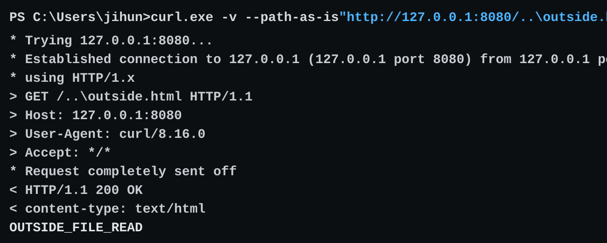

# Vert.x TemplateHandler Windows path sample

Small sample for checking how `TemplateHandler` handles a Windows-style
backslash path on a regex route. This uses the Vert.x Thymeleaf template engine.

Run on Windows:

```bash
cd /path/to/vertx-templatehandler-windows-path-sample
mvn -q compile exec:java
```

This starts a local server on `127.0.0.1:8080`.

In another terminal, send a request containing a raw backslash path:

```powershell
curl.exe -v --path-as-is "http://127.0.0.1:8080/..\outside.html"
```

The verbose output should show the request path:

```text
GET /..\outside.html HTTP/1.1
```

On Windows, the response body may include:

```text
OUTSIDE_FILE_READ
```

Example output:



The repository includes these harmless files:

```text
templates/inside.html
outside.html
```

The Java program only starts the local Vert.x HTTP server. It does not access OS
files or modify files.
